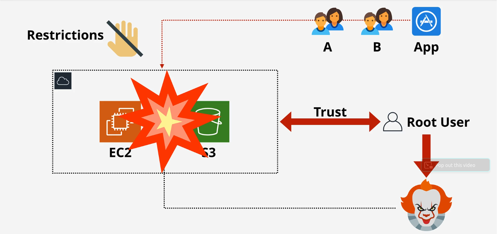
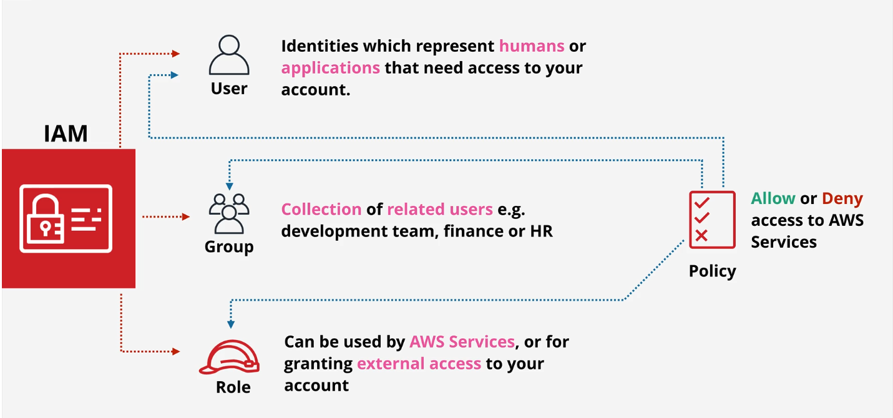

# AWS IAM (Identity and Access Management) basics

- [AWS IAM (Identity and Access Management) basics](#aws-iam-identity-and-access-management-basics)
  - [1. Giới thiệu chung](#1-giới-thiệu-chung)
  - [2. Giới thiệu AWS Identity and Access Management (IAM)](#2-giới-thiệu-aws-identity-and-access-management-iam)
    - [1. IAM là gì?](#1-iam-là-gì)
    - [2. Tại sao lại cần đến dịch vụ IAM?](#2-tại-sao-lại-cần-đến-dịch-vụ-iam)
    - [3. Một số thành phần trong IAM](#3-một-số-thành-phần-trong-iam)
  - [3. IAM Identity Policy (IAM Policy)](#3-iam-identity-policy-iam-policy)
  - [4. Tổng kết](#4-tổng-kết)

## 1. Giới thiệu chung

Ở bài này chúng ta cùng nhau tìm hiểu dịch vụ IAM. Dịch vụ IAM là dịch vụ quan trọng giúp xác thực và quản lý quyền truy cập vào các tài nguyên trên AWS. 

## 2. Giới thiệu AWS Identity and Access Management (IAM)

### 1. IAM là gì?

AWS Identity and Access Management (IAM) giúp bạn quản lý việc xác thực và quyền truy cập vào các tài nguyên trên AWS. Sử dụng IAM bạn có thể tạo và quản lý các users, group users và có thể thêm các quyền để cho phép hoặc không cho phép truy cập đến tài nguyên nào đó trên AWS. Bạn có thể tham khảo thêm tài liệu chính thức của AWS [tại đây](https://aws.amazon.com/vi/iam/).

### 2. Tại sao lại cần đến dịch vụ IAM?

Khi tạo một tài khoản AWS thì tài khoản đó gọi là tài khoản root. Tài khoản này thì không bị giới hạn quyền truy cập đến tài nguyên trên AWS, AWS khuyên không nên sử dụng tài khoản root cho việc xử lý các tác vụ hàng này. Ví dụ công ty bạn có nhiều phòng ban, ứng dụng muốn tương tác với tài nguyên trên AWS thì không thể cấp cho họ tài khoản root được mà phải tạo các IAM User và gán cho họ những quyền nhất định, để kiểm soát việc truy cập của họ đến các tài nguyên trên AWS.

### 3. Một số thành phần trong IAM

AWS IAM cho phép tạo 3 loại Identity objects như hình trên đó là:

- `IAM User`: Đại diện cho người hoặc ứng dụng nào đó cần truy cập đến tài khoản AWS. VD: Thành cần truy cập đến hóa đơn của tài khoản AWS và Dũng thì cần truy cập đến các dịch vụ của AWS như EC2, Dũng cần tạo và tắt các EC2 instances. Thì lúc này Thành và Dũng cần phải tạo các IAM User bên trong dịch vụ IAM. IAM User này cũng có thể sử dụng cho các ứng dụng.

- `IAM Group`: Là một nhóm các IAM User. VD có thể tạo ra một nhóm Develop và gán quyền cho nhóm này, thì các IAM User khi được thêm vào nhóm Develop cũng có quyền của nhóm luôn, không phải đi gán quyền cho từng IAM User.

- `IAM Role`: Thường được sử dụng để gán quyền truy cập đến các dịch vụ trên AWS. VD nếu bạn muốn tất cả EC2 instance đều có thể truy cập đến S3, bạn sẽ tạo một role với quyền truy cập đến S3 và sau đó sẽ cho EC2 instance sử dụng role này. (cái này hơi khó hiểu, sẽ có demo ở phần sau).

- `IAM Policy`: Là tập hợp các rule để định nghĩa việc cho phép (Allow) hoặc không cho phép (Deny) truy cập vào dịch vụ trên AWS.

## 3. IAM Identity Policy (IAM Policy)

IAM Policy là một loại của policy và IAM Policies sẽ được gán với các Identity(IAM User, IAM Group, IAM Role). IAM Policy gồm các rule để mô tả việc cho phép (allow) hoặc không cho phép (deny) truy cập đến các dịch vụ trên AWS.

## 4. Tổng kết