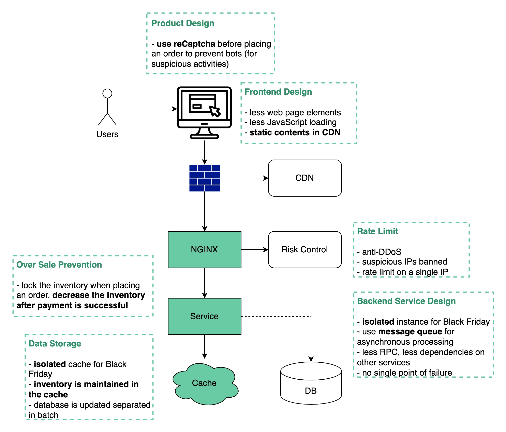

# Black Friday Flash Sale

Để thiết kế được một hệ thống bán hàng, vừa đảm bảo được <mark style="color:blue;">tính high concurrency, high availability and quick responsiveness</mark> thì một kỹ sư xây dựng hệ thống cần phải xem xét rất kỹ lưỡng các khía cạnh về cả backend và frontend.

\
Xem sở đồ dưới đây để hiểu hơn:

<figure><figcaption>
Hệ thống xử lý của một website bán hàng
</figcaption></figure>

Hệ thống cần phải tuân thủ các nguyên tắc thiết kế (design principles):

1. Càng tối giản càng tốt: Càng ít các thành phần của trang web, ít các truy vấn (queries) tới database, ít các request tới server, ít các phụ thuộc trong hệ thống thì càng tốt.
2. Short critical path: Tối ưu để ít các bước nhảy (chuyển đổi trang) giữa các dịch vụ, hoặc hợp nhất chúng lại thì càng tốt. User không cần phải click chuyển trang quá nhiều.
3. Khả năng xử lý bất đồng bộ: Sử dụng message queues để xử lý các giao dịch có tốc độ cao. (high TPS - high Transaction Per Second)
4. Tính độc lập (isolation): Độc lập về cả nội dung tĩnh và nội dung động, độc lập về cả các tiến trình và database cho các vật phẩm hiếm (các sản phẩm đặc biệt, có thể lượng người mua nhiều).
5. Overselling is bad: Bán quá nhiều là không tốt, cẩn thận trong việc giảm lượng hàng còn lại trong kho.
6. Trải nghiệm người dùng là quan trọng: Chúng ta hoàn toàn không muốn khi khách hàng đã lựa chọn order thành công, nhưng sau đó lại thông báo với người dùng rằng số lượng sản phẩm còn lại không khả dụng (không còn). Tình trạng này chắc hẳn nhiều bạn đã gặp phải khi săn sale shopee, add sản phẩm vào giỏ hàng nhưng khi thanh toán lại nhận được thông báo, sản phẩm đã hết.

Trong bài viết này, chúng ta đã đề cập tới một số khái niệm như [CDN](https://aws.amazon.com/vi/cloudfront/), [NGINX](https://www.nginx.com/) những khái niệm này sẽ được tìm hiểu ở những bài viết sau, cùng với cơ chế [load balancing](https://www.google.com/search?q=load+balancing\&oq=load+balancing\&aqs=chrome..69i57j0i512l9.759j0j4\&sourceid=chrome\&ie=UTF-8). Các bạn cùng chờ đón nhé!

Nội dung trên được dịch lại từ [https://blog.bytebytego.com/p/black-friday-flash-sale](https://blog.bytebytego.com/p/black-friday-flash-sale)

Tìm hiểu cách xây dựng kiến trúc của Netflix:\
[https://utech-organization.gitbook.io/system-design/](https://utech-organization.gitbook.io/system-design/)
